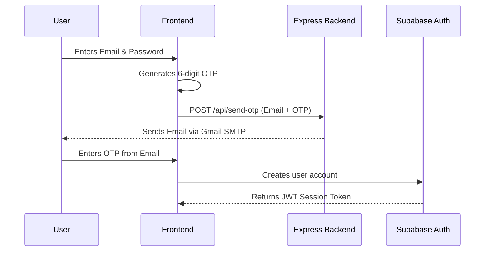

# 🏗️ TrueStyle Architecture & Infrastructure Overview

This document provides a highly structured, top-to-bottom breakdown of the TrueStyle application. It is designed to give any developer a crystal-clear understanding of how the Frontend, Backend, Databases, and Testing infrastructure connect.

---

## 🖥️ 1. Frontend Architecture

The frontend is a Single Page Application (SPA) built for high performance and modern UI/UX.

| Component | Technology | Description |
| :--- | :--- | :--- |
| **Framework** | **React 18** (TypeScript) | Core UI library using functional components and hooks. |
| **Bundler** | **Vite** | Extremely fast development server and production bundler. |
| **Styling** | **Tailwind CSS** | Utility-first CSS framework for rapid, responsive UI design. |
| **State Management** | **React Context API** | Manages global authentication state (`AuthContext.tsx`). |
| **Routing** | **React Router DOM** | Handles client-side navigation between pages. |
| **Machine Learning** | **TensorFlow.js (MobileNet)** | Client-side image classification for product verification. |
| **OCR** | **Tesseract.js** | Client-side Optical Character Recognition to read labels. |

### Key Frontend Directories
*   `src/components/`: Reusable UI elements (Buttons, Cards, Navbars).
*   `src/pages/`: Full-page views (Dashboard, ProductVerification, Login).
*   `src/context/`: Global state providers (Authentication).
*   `src/services/`: Abstraction layers for external APIs and databases.

---

## ⚙️ 2. Backend Architecture

The backend is a lightweight microservice designed strictly to handle tasks that cannot be done securely or efficiently on the client.

| Component | Technology | Description |
| :--- | :--- | :--- |
| **Runtime** | **Node.js** | JavaScript runtime environment executing the server. |
| **Framework** | **Express.js** | Minimalist web framework handling HTTP routing. |
| **Email Service** | **Nodemailer + Gmail SMTP** | Securely relays OTP emails to users. |
| **Web Scraper** | **Axios + Cheerio** | Fetches and parses HTML from external product URLs. |

### API Endpoints (`server/index.js`)
1.  `POST /api/send-otp`: Accepts an email address and OTP code, then sends an email to the user.
2.  `POST /api/scrape`: Accepts a URL, fetches the webpage, and returns metadata (title, price, image).

---

## 🗄️ 3. Database Architecture (Hybrid)

TrueStyle uses a unique dual-database approach, routing requests through `databaseRouter.ts` based on environment configuration.

### Primary: Supabase (PostgreSQL)
Used for live production data with strict relational integrity.

| Table | Purpose | Security (RLS) |
| :--- | :--- | :--- |
| **`profiles`** | User accounts and roles (admin vs user). | Users can read/write their own profile. |
| **`product_scans`** | History of items verified by the ML engine. | Users can only see their own scans. |
| **`official_brands`** | Master list of verified authentic brands. | Public read; Admin-only write. |
| **`trusted_sellers`** | Directory of verified merchants. | Public read; Admin-only write. |
| **`support_tickets`** | Customer service inquiries. | Users see their own; Admins see all. |

### Secondary: Firebase Firestore
Used primarily for flexible document storage and as a fallback database.
*   **Security Rules (`firestore.rules`)**: Enforces access control, ensuring users only access their own documents unless they have an `admin` custom claim.

---

## 📁 4. File Storage

| Component | Technology | Description |
| :--- | :--- | :--- |
| **Provider** | **Firebase Storage** | Stores user-uploaded images (profile pictures, product scan photos). |
| **Security** | **Storage Rules** | `storage.rules` enforces that files must be images (`image/jpeg`, `image/png`) and under a specific file size. |

---

## 🔐 5. Authentication Flow

Authentication is handled by **Supabase Auth** with a custom OTP (One Time Password) implementation.

---

## 🛡️ 6. Security & Load Testing Infrastructure

A comprehensive suite of tools ensures the platform remains secure and performant.

### 🐛 Security Review (`Vulnerability Test Results/`)
*   **Static Code Analysis**: Automated identification of hardcoded secrets and vulnerable logic.
*   **Dependency Scanning**: `npm audit` checking for known CVEs in third-party packages.
*   **Excel Reports**: Detailed risk matrices and endpoint inventories (`findings.xlsx`).

### 🚀 Load Testing (`load-tests/`)
*   **Smoke Test**: 10-second server health check.
*   **Baseline Test**: 100 concurrent users for 60 seconds (Proven capable of ~2,800 RPS).
*   **Stress Test**: 500+ concurrent users to find the server breaking point.

### 🤖 CI/CD Automation (`.github/workflows/`)
*   `security-review.yml`: Runs security scanners on every code push.
*   `load-testing.yml`: Automates performance testing and generates downloadable HTML/Excel artifacts.
